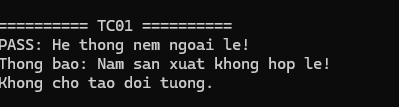
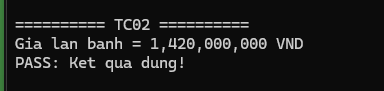
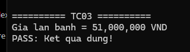
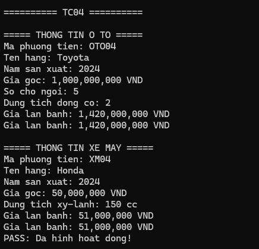
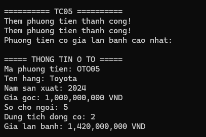

# BÀI 2: QUẢN LÝ PHƯƠNG TIỆN

## TC01: Kiểm tra Validation năm sản xuất

**Thao tác:** Khởi tạo ô tô có NamSanXuat = 1850.

**Kết quả mong đợi:** Hệ thống ném ArgumentException và không cho tạo đối tượng.

### Hình ảnh kết quả TC01

---

## TC02: Kiểm tra tính giá lăn bánh ô tô

**Thao tác:** Ô tô 5 chỗ, GiaGoc = 1.000.000.000 VND.

**Kết quả mong đợi:** Giá lăn bánh = 1.420.000.000 VND.

### Hình ảnh kết quả TC02

---

## TC03: Kiểm tra tính giá lăn bánh xe máy

**Thao tác:** Xe máy 150cc, GiaGoc = 50.000.000 VND.

**Kết quả mong đợi:** Giá lăn bánh = 51.000.000 VND.

### Hình ảnh kết quả TC03

---

## TC04: Kiểm tra đa hình List<PhuongTien>

**Thao tác:** Nạp 1 ô tô và 1 xe máy vào List<PhuongTien>, gọi TinhGiaLanBanh() trong vòng lặp.

**Kết quả mong đợi:** C# tự động gọi đúng công thức tính giá lăn bánh tương ứng của ô tô và xe máy.

### Hình ảnh kết quả TC04

---

## TC05: Kiểm tra tìm giá lăn bánh cao nhất

**Thao tác:** Gọi hàm FindMaxGiaLanBanh().

**Kết quả mong đợi:** Trả về ô tô Toyota 5 chỗ có giá lăn bánh 1,42 tỷ VND.

### Hình ảnh kết quả TC05

---

## Kết luận

Chương trình đã thực hiện các chức năng quản lý phương tiện và kiểm thử các trường hợp TC01 đến TC05.

